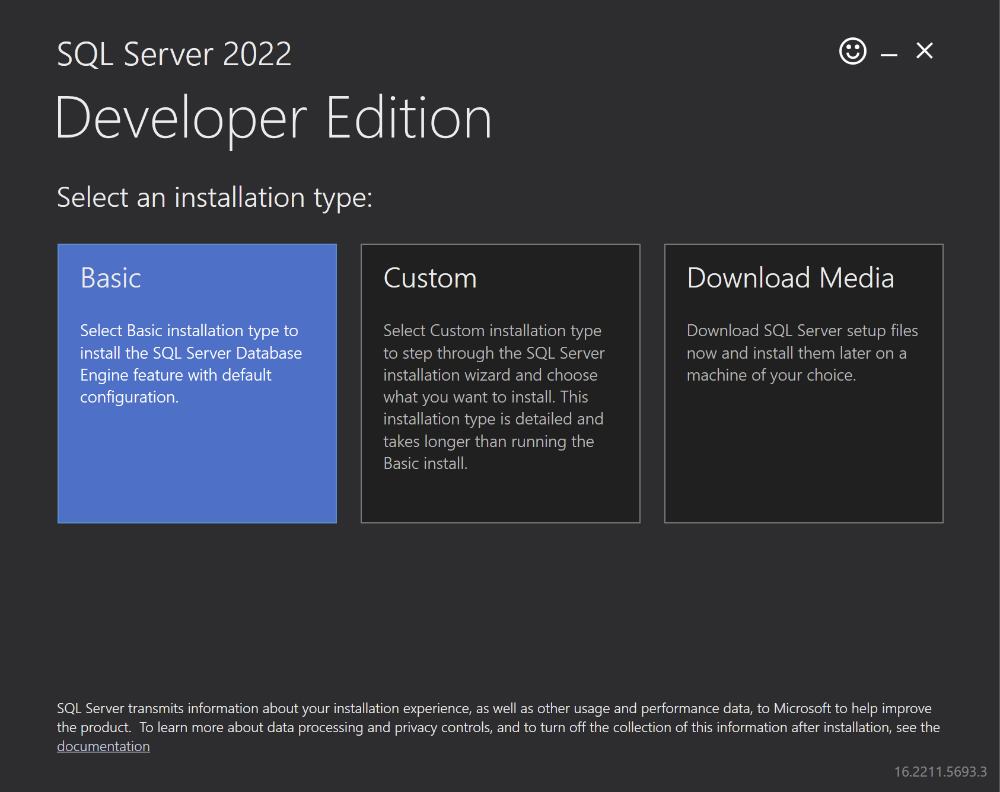
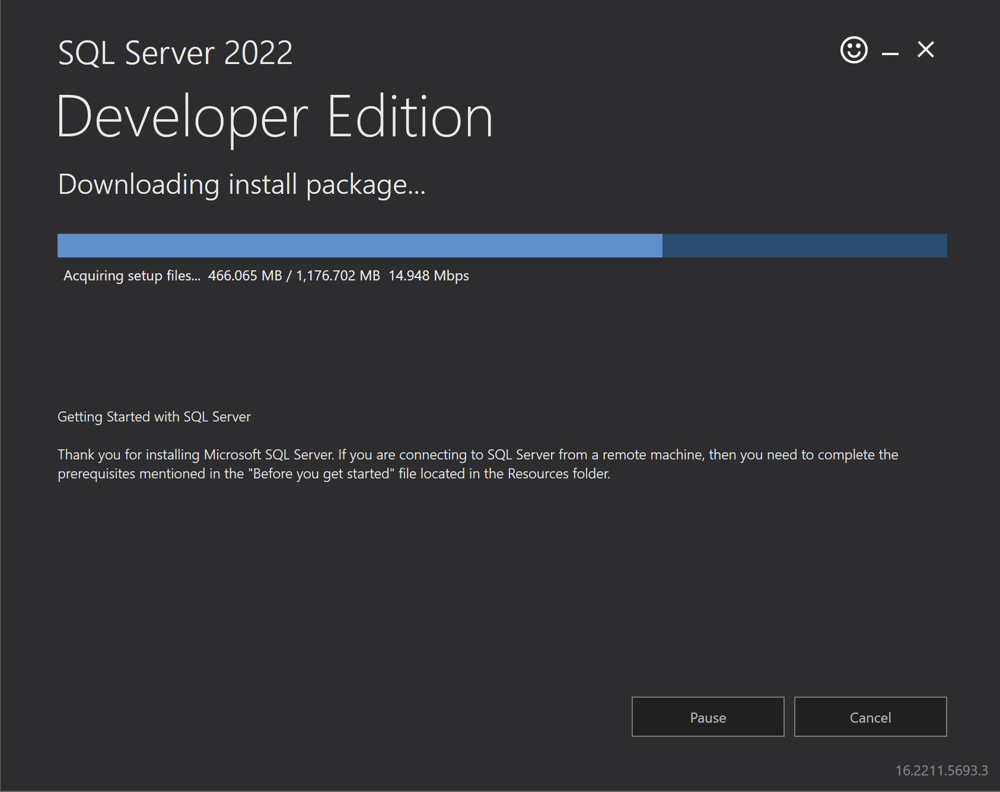
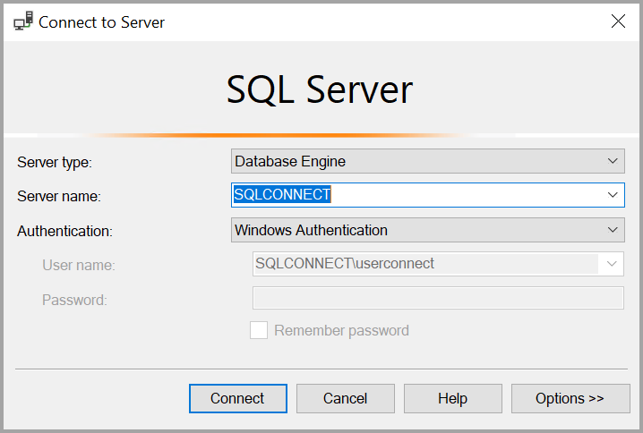

# Install .NET and SQL Server environment in Visual Studio Code

>Instructions for installing the .NET application development environment on Visual Studio Code and using Microsoft SQL Server database. SQL Server will be installed running on Docker. You can use this guide to do it on Windows, MacOS, Linux.

You can also use some IDEs that have a built-in .NET running environment such as `Visual Studio`, `Visual Studio for Mac` or `Jetbrains Rider`...

## Install .NET

* **Step 1: Download and install [.NET SDK](https://dotnet.microsoft.com/en-us/download).**
  Prioritize choosing a stable version with `long-term support`.
  
* **Step 2: Check for successful installation**
  run the following command:

  ```bash
  dotnet --version
  ```

* **Step 3: Initialize a .NET project**
  run the following command:

  ```bash
  dotnet new webapp -o aspnetcoreapp
  ```

  After, run the following commands:

  ```bash
  cd aspnetcoreapp
  dotnet watch run
  ```

  

Above is the entire process of installing the .NET environment, see more at [dotnet.microsoft.com](https://dotnet.microsoft.com).

## Install SQL Server

### For MacOS

`SQL Server` needs to be installed on `Docker`:

* **Step 1: Install Docker**

  * For Mac with `Apple Silicon` (M1, M1 Pro, M1, Max, M1 Ultra, M2, M3,...) according to [information from Docker's manual page](https://docs.docker.com/desktop/install/mac-install/), if you are using an Mac with Apple Silicon then you need to install Rosetta 2 because some of its binaries are still Darwin/AMD64. To install Rosetta 2 manually from the command line, run the following command:

    ```bash
    softwareupdate --install-rosetta
    ``````

  * Download and install [Docker](https://docs.docker.com/desktop/install/mac-install/).
  * In the `Preferences`, select `Resources`. Here, we need to increase the default allocated memory of the Docker engine to `6GB` for SQL Server to run properly. Although allocating 4GB will suffice, however, to obtain better performance, you should allocate as much memory as possible.

    
* **Step 2: Install SQL Server on Docker**
  * Install SQL Server by executing the following command:

    ```bash
    sudo docker pull mcr.microsoft.com/azure-sql-edge:latest
    ```

    >**Important:** Install the correct `version of SQL Server` required, refer to [Microsoft SQL Server - Ubuntu based images](https://hub.docker.com/_/microsoft-mssql-server).

  * Continue with the command:

    ```bash
    sudo docker run --cap-add SYS_PTRACE -e 'ACCEPT_EULA=1' -e 'MSSQL_SA_PASSWORD=Password.1' -p 1433:1433 --name azuresqledge -d mcr.microsoft.com/azure-sql-edge
    ```

    You can change `Password.1` to another password you want.

    >**Note**: SQL Server's password requires the following:
    >* At least 8 characters.
    >* Has lowercase letters, uppercase letters, numbers, and special characters.
  * In case you want to change the password after creating SQL Server, use this command:

    ```bash
    sudo docker exec -it azuresqledge /opt/mssql-tools/bin/sqlcmd \
    -S localhost -U SA -P "<Old_Password>" \
    -Q 'ALTER LOGIN SA WITH PASSWORD="<New_Password>"'
    ```

  * You can `pause, restart, and delete` SQL Server right in the Docker interface.

    
* **Step 3: Install `Azure Data Studio`**
  * Download and install [Azure Data Studio](https://learn.microsoft.com/en-us/azure-data-studio/download-azure-data-studio?tabs=win-install%2Cwin-user-install%2Credhat-install%2Cwindows-uninstall%2Credhat-uninstall)
  * Connect to database:

    

### For Windows

installing `SQL Server` is simpler:

* **Step 1: Install SQL Server**

  * Download [SQL Server](https://www.microsoft.com/en-us/sql-server/sql-server-downloads)
  * Install SQL Server:

    Select Basic:

    

    Continue, click Accept:

    

    Continue, click Install:

    

    Installation is in progress:

    
    After this process ends, SQL Server has been successfully installed.

* **Step 2: Install SQL Server Management Studio (SSMS)**

  * Download [SQL Server Management Studio (SSMS)](https://learn.microsoft.com/en-us/sql/ssms/download-sql-server-management-studio-ssms?view=sql-server-ver16&viewFallbackFrom=sql-server%02ver15&_ga=2.163492156.1498026359.1700104972-2130380837.1700104970)
  * Install SQL Server Management Studio (SSMS):
  * Connect to database:

    

Above is the entire SQL Server installation process, see more at [SQL Server installation guide](https://learn.microsoft.com/en-us/sql/database-engine/install-windows/install-sql-server?view=sql-server-ver16).
